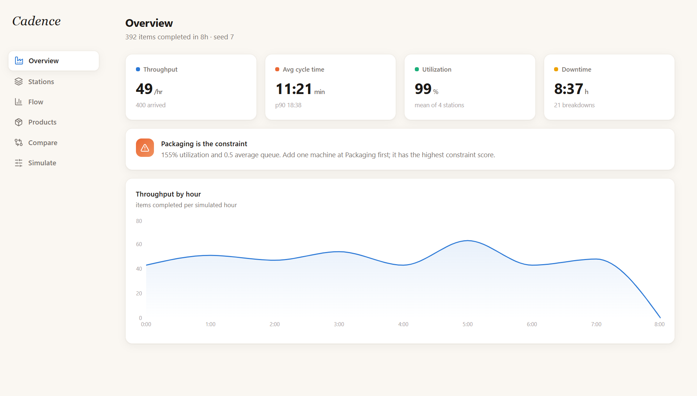
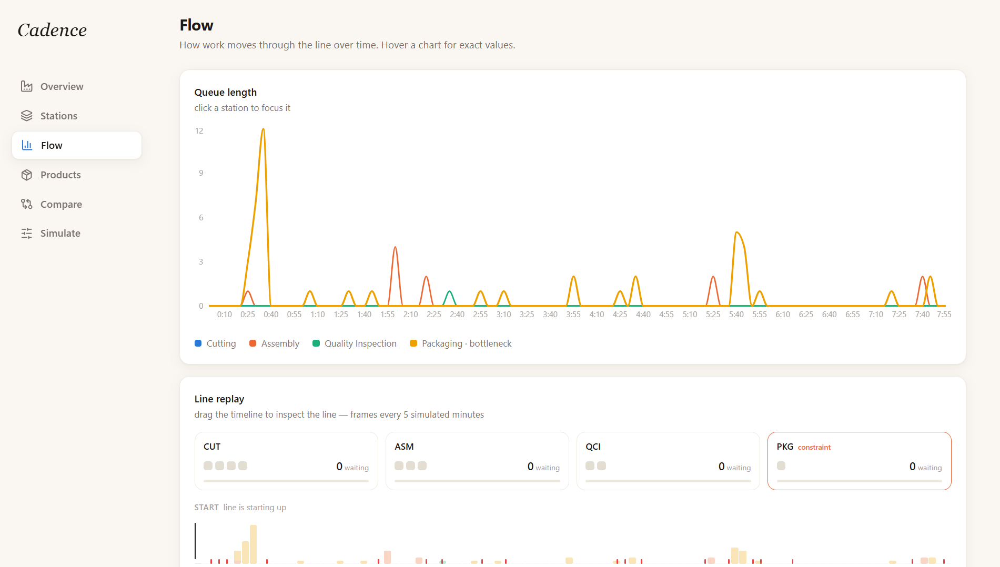
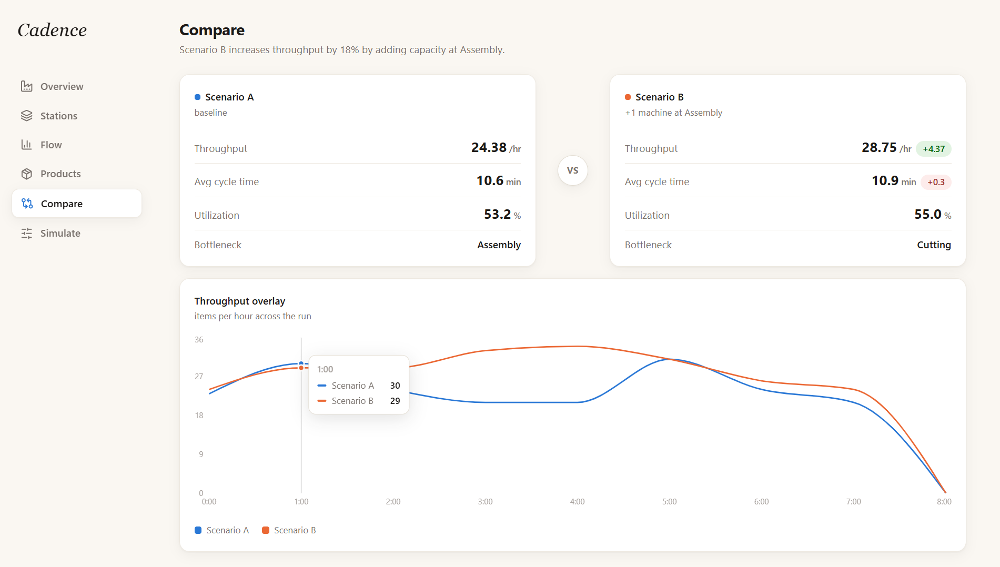

<div align="center">

# Cadence

**A discrete-event simulation of a four-station factory line, engineered to expose the true constraint before it costs you real throughput.**

</div>

<p align="center">
  <br/>
  
  
</p>

<p align="center">⸻</p>

Cadence models a production line composed of four sequential stations, Cutting, Assembly, Quality Inspection, and Packaging, each operating its own bank of parallel machines. Orders arrive stochastically, are routed through the line according to product type, accumulate in queue whenever a station reaches capacity, and periodically encounter equipment failure before continuing downstream. The dashboard renders that process legible: where work-in-process is accumulating, which station is the binding constraint on system throughput, and how the line responds when a proposed change is applied.

<br>

<table>
<tr>
<td width="50%" valign="top">

### What the simulation models

- **Four stations in series**: an independently configurable count of parallel machines per station, so capacity can be allocated station by station rather than uniformly
- **Product-specific routing**: certain products bypass Quality Inspection entirely, others are looped back through Assembly for rework, each carrying its own processing-time distribution
- **Stochastic arrivals**: modeled as a random process rather than a fixed schedule, consistent with how demand actually presents itself
- **Priority dispatching**: rush orders preempt the standard queue, with the resulting delay imposed on other orders made explicit in the output
- **Reliability modeling**: machine breakdowns and repairs governed by mean time between failures and mean time to repair

</td>
<td width="50%" valign="top">

### What the dashboard shows you

- **Configuring a run**: arrival rate, simulation horizon, share of rush orders, machine reliability parameters, and machine count per station
- **Observing the line in motion**: queues forming, machines cycling between idle, busy, and failed states, and which station currently constrains the system
- **Reviewing the metrics that matter**: throughput, cycle time, utilization, and downtime, disaggregated by station and by product
- **Evaluating a decision before committing to it**: a baseline and a proposed alternative run side by side, with the resulting difference reported directly rather than estimated

</td>
</tr>
</table>

<br>

### Running it locally

**Backend**

```bash
cd backend
python -m venv .venv
.venv\Scripts\Activate.ps1        # Windows
# source .venv/bin/activate        # macOS/Linux
pip install -r requirements.txt
uvicorn app.main:app --reload --port 8000
```

**Frontend** (in a second terminal)

```bash
cd frontend
npm install
npm run dev
```

Then open `http://localhost:5173`.

<br>

---

<div align="center">
<sub>Released under the MIT License · see <code>LICENSE</code> for details</sub>
</div>
